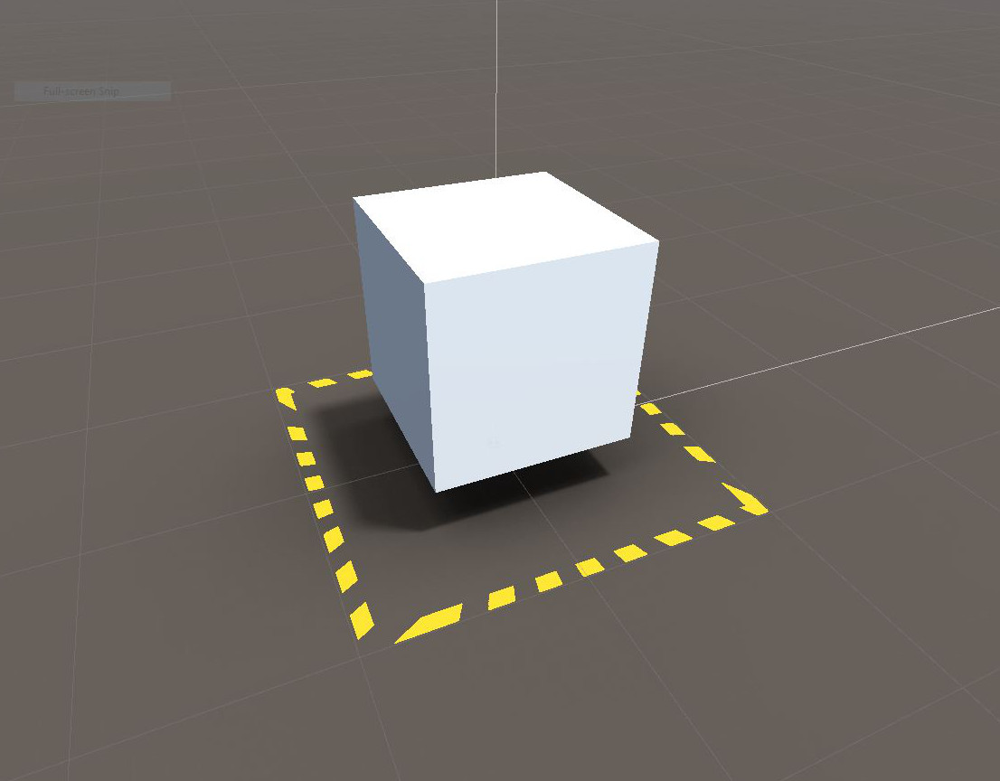

### **ARFoundation Static Shadow Demo**

Simple base Unity **ARFoundation** (Augmented Reality) **template** project, enhanced from the fantastic 
[Youtube tutorial by The Unity Workbench](https://www.youtube.com/watch?v=Ml2UakwRxjk)

This brings that project into **Unity 2019.1.5f1**, and fixes some issues regarding how Raycast Hits are now managed.
This project adds a simple canvas with slider controls to allow for adding Scaling and Rotation functionality, using the session origin component's **MakeContentAppearAt** method.

This project utilizes the Asset Store package **Amplify Shader Editor**, which isn't included, and not needed for ARFoundation. It was used primarily for shader creation of the included animated PlacementIndicator base.

